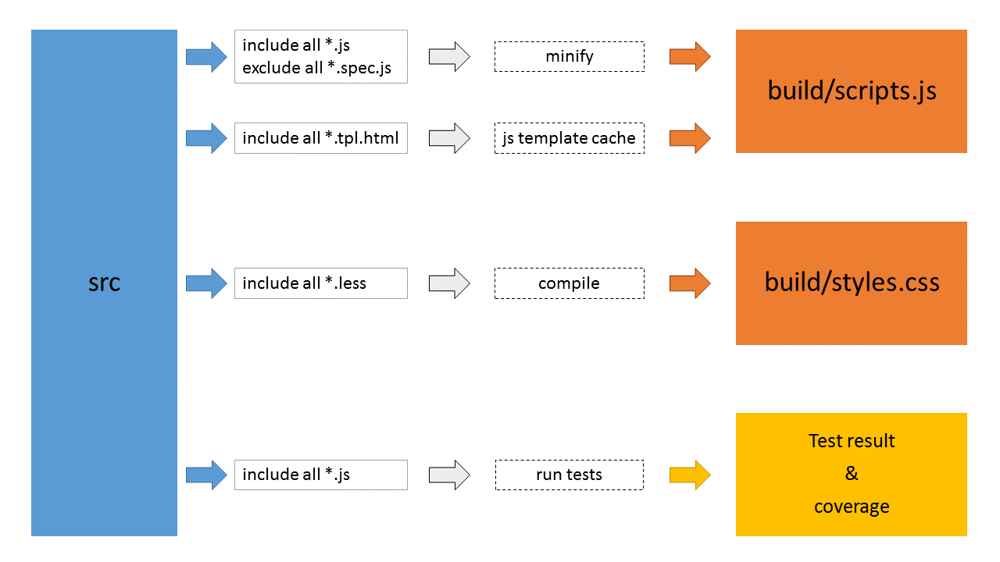

Angular-KOG-2014
================

## Prerequisites

These components need to be installed

- NodeJS:	http://nodejs.org/
- GIT:		http://git-scm.com/book/en/v2/Getting-Started-Installing-Git
- Grunt:	`npm install -g grunt-cli`

## Setup

**Install node packages**

`npm install`

**Install bower dependencies**

`bower install`

## Run

**Build and run app**

`grunt`

**Build app**

`grunt build`

**Run app**

`grunt connect`

**Develop app**

`grunt dev`

## About

**This basic angular app contains:**
- Component based folder structure
- Routing
- Unit test with mock server
- Basic service
- Basic directive
- SCE (Strict Contextual Escaping)
- Animations
- ...and more

## Grunt build

*.js : Controllers, directives, services, etc

*.spec.js : Unit test specs

*.tpl.html : Templates

*.less : Uncompiled css

